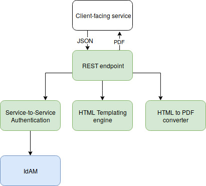

# PDF service

[](https://codecov.io/gh/hmcts/rpe-pdf-service)

This is a PDF service which allows to generate read-only PDFs based on given template in HTML/Twig format and
placeholder data in JSON format.
The service provides a single RESTful endpoint that merges both template and placeholder data together and
returns the PDF as a binary stream.

The template, besides containing ordinary HTML markup, can also contain inline CSS styling and embedded images.

### Getting started

### Prerequisites

- [JDK 8](https://www.oracle.com/java)
- [Docker](https://www.docker.com)



### Building

The project uses [Gradle](https://gradle.org) as a build tool but you don't have to install it locally since there is a
`./gradlew` wrapper script.

To build project please execute the following command:

```bash
    ./gradlew build
```

### Running

First you need to create distribution by executing following command:

```bash
    ./gradlew installDist
```

When the distribution has been created in `build/install/pdf-service` directory,
you can run the application by executing following command:

```bash
    docker-compose up
```

As a result the following container(s) will get created and started:
 - long living container for API application exposing port `5500`

### API documentation

API documentation is provided with Swagger:
 - `http://localhost:5500/swagger-ui.html` - UI to interact with the API resources

NOTE: Swagger scans classes in the `uk.gov.hmcts.reform.pdfservice.controllers` package.

### Consuming
There is a client library provided for java https://github.com/hmcts/cmc-pdf-service-client

### Docker
Image is available in the HMCTS azure container registry (currently private) @ `hmcts.azurecr.io/hmcts/rpe/pdf-service`. See usage example in: [docker-compose.yml](docker-compose.yml)

#### Non ASCII Characters Support

To render PDF with non ASCII characters, please use the 'Open Sans' font-family.

```css
font-family: 'Open Sans';
```

Example:

```html
<head>
   <style>
      html {
      font-family: 'Open Sans';
      }
   </style>
</head>

```

## Developing

### Unit tests

To run all unit tests please execute following command:

```bash
    ./gradlew test
```

### Coding style tests

To run all checks (including unit tests) please execute following command:

```bash
    ./gradlew check
```

## Versioning

We use [SemVer](http://semver.org/) for versioning.
For the versions available, see the tags on this repository.

## Standard API

We follow [RESTful API standards](https://hmcts.github.io/restful-api-standards/).

## License

This project is licensed under the MIT License - see the [LICENSE.md](LICENSE) file for details.
